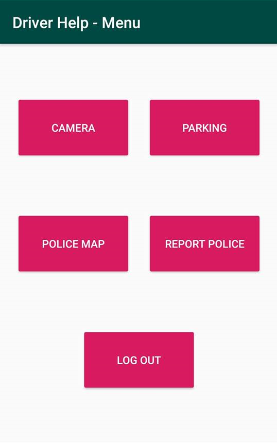

# Driver-Help

# About application

This application can be used to record videos, record and save your current position, but also a google map that users can edit (add speed cameras). The application use a local sql database to save the parking position, google map api for map, and real-time firebase database for real-time map update.
