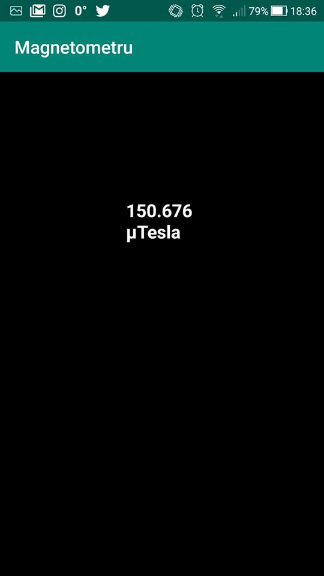
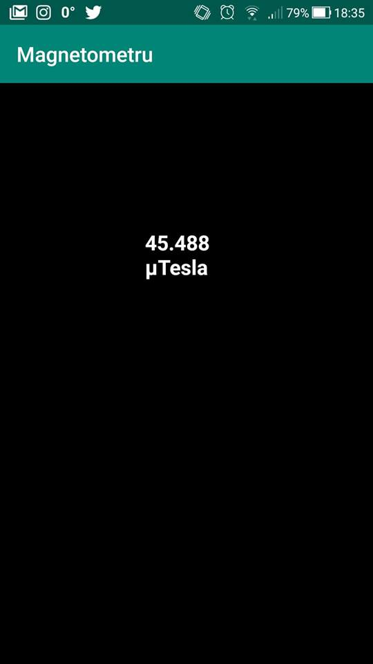

Aplicatia Magnetometru foloseste senzorul telefonului.

Prin sensor manager avem acces la datele transmise de senzor care vor fi transformate pentru a putea fi afisate in micro tesla.

Daca apropiem telefonul cu aplicatia ruland de un obiect cu un camp electromagnetic, valoarea afisata de aplicatie creste iar daca indepartam valorile scad. 

In mediu normal valorile raman la cota valorii campului electromagnetic din jur ce poate fi captat si masurat de senzorul telefonului.

